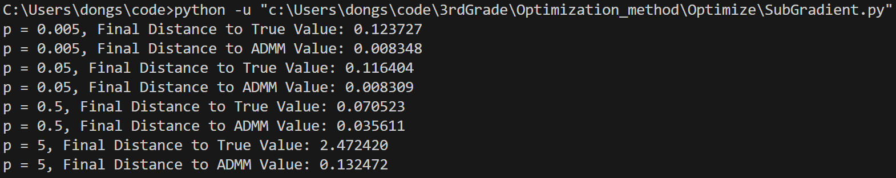

## 分布式优化问题

考虑一个10节点的分布式系统节点i有线性测量  $\mathbf{b}_i=A_i\mathbf{x}+\mathbf{e}_i$ ，其中 $\mathbf{b}_i$ 为10维的测量值， $A_i$ 为10*200维的测量矩阵， $\mathbf{x}$ 为200维的未知稀疏向量且稀疏度为5， $\mathbf{e}_i$ 为10维的测量噪声从所有 $\mathbf{b}_i$ 与 $A_i$ 中恢复 $\mathbf{x}$ 的一范数规范化最小二乘模型如下

$$\min \frac{1}{2}\sum_1^{10}\|A_i\mathbf{x}-\mathbf{b}_i\|_2^2 + p\|\mathbf{x}\|_1$$

其中p为非负的正则化参数请设计下述分布式算法求解该问题

**交替方向乘子法
邻近点梯度法
次梯度法**

在实验中，设  $\mathbf{x}$  的真值中的非零元素服从均值为 0 方差为 1 的高斯分布， $A_i$  中的元素服从均值为 0 方差为 1 的高斯分布， $\mathbf{e}_i$  中的元素服从均值为 0 方差为 0.1 的高斯分布

对于每种算法，请给出每步计算结果与真值的距离以及每步计算结果与最优解的距离此外，请讨论正则化参数 p 对计算结果的影响

<font color=blue>代码在 `windows` 本地环境运行，在 `initialize.py` 中修改正则化参数 p </font>

### 1、交替方向乘子法

为了比较每一种方法计算的结果与最优解的距离，我选择交替方向乘子法作为迭代的**最优解**

#### （1）算法设计

为了使用交替方向乘子法（ADMM）求解10节点分布式系统中的稀疏恢复问题，我们将问题分解为局部优化和全局协调的交替过程以下是算法设计过程

**增广拉格朗日法**
引入局部变量 $\mathbf{x}_i$ 和全局变量 $\mathbf{z}$ ，约束 $\mathbf{x}_i = \mathbf{z}$ ，问题转换为
$$
\min \sum_{i=1}^{10} \frac{1}{2}\|A_i\mathbf{x}_i - \mathbf{b}_i\|_2^2 + p\|\mathbf{z}\|_1 \quad \text{st} \quad \mathbf{x}_i = \mathbf{z}, \forall i
$$

$$
L_c(\mathbf{x}_i, \mathbf{z}, \mathbf{v}_i) = \sum_{i=1}^{10} \left[ \frac{1}{2}\|A_i\mathbf{x}_i - \mathbf{b}_i\|_2^2 + \mathbf{v}_i^T(\mathbf{x}_i - \mathbf{z}) + \frac{c}{2}\|\mathbf{x}_i - \mathbf{z}\|_2^2 \right] + p\|\mathbf{z}\|_1
$$
其中 $\mathbf{v}_i$ 为对偶变量， $c > 0$ 为惩罚参数

**局部变量 $\mathbf{x}_i$ 更新（并行）**
$$
     \mathbf{x}_i^{k+1} = \arg\min_{\mathbf{x}_i} \frac{1}{2}\|A_i\mathbf{x}_i - \mathbf{b}_i\|_2^2 + \frac{c}{2}\|\mathbf{x}_i - \mathbf{z}^k \|_2^2 + (\mathbf{v}_i^k)^Tx_i
$$
目标函数为强凸函数，局部最优解即为全局最优解，求梯度易得
$$
A_i^T(A_i\mathbf{x}_i - \mathbf{b}_i) + c(\mathbf{x}_i - \mathbf{z}^k) + \mathbf{v}_i^k = 0
$$
$$
 \mathbf{x}_i^{k+1} = \left(A_i^\top A_i + cI \right)^{-1}\left(A_i^\top \mathbf{b}_i + c\mathbf{z}^k - \mathbf{v}_i^k\right)
$$

**全局变量  $\mathbf{z}$  更新（中心聚合）**
中心节点收集所有  $\mathbf{x}_i^{k+1}$  后，求解
$$
\mathbf{z}^{k+1} = \arg\min_{\mathbf{z}} \sum_{i=1}^{10} \left[ \frac{c}{2}\|\mathbf{x}_i^{k+1} - \mathbf{z}\|_2^2 - (\mathbf{v}_i^k)^T\mathbf{z} \right] + p\|\mathbf{z}\|_1
$$
目标函数可整理为
$$
\frac{c}{2} \sum_{i=1}^{10} \|\mathbf{x}_i^{k+1}\|_2^2 - c \mathbf{z}^T \sum_{i=1}^{10} \mathbf{x}_i^{k+1} + \frac{10c}{2} \|\mathbf{z}\|_2^2 - \mathbf{z}^T \sum_{i=1}^{10} \mathbf{v}_i^k + p\|\mathbf{z}\|_1
$$
忽略常数项  $\frac{c}{2} \sum_{i=1}^{10} \|\mathbf{x}_i^{k+1}\|_2^2$ ，剩余项为
$$
5c \|\mathbf{z}\|_2^2 - \mathbf{z}^T \left( c \sum_{i=1}^{10} \mathbf{x}_i^{k+1} + \sum_{i=1}^{10} \mathbf{v}_i^k \right) + p\|\mathbf{z}\|_1
$$
配方，有
$$
\mathbf{z}^{k+1} = \arg\min_{\mathbf{z}} 5c \left\| \mathbf{z} - \frac{1}{10} \sum_{i=1}^{10} \left( \mathbf{x}_i^{k+1} + \frac{\mathbf{v}_i^k}{c} \right) \right\|_2^2 + p\|\mathbf{z}\|_1
$$
令
$$
   \mathbf{d} = \frac{1}{10} \sum_{i=1}^{10} \left( \mathbf{x}_i^{k+1} + \frac{\mathbf{v}_i^k}{c} \right)
   $$
则
$$
   5c \|\mathbf{z} - \mathbf{d}\|_2^2 + p\|\mathbf{z}\|_1
   $$
对每个分量  $z_j$ ，优化问题为
   $$
   5c (z_j - d_j)^2 + p|z_j|
   $$

（1）当  $z_j > 0$  时，次梯度条件为
     $$
     10c(z_j - d_j) + p = 0 \quad \Rightarrow \quad z_j = d_j - \frac{p}{10c}
     $$
     需满足  $d_j - \frac{p}{10c} > 0$ ，即  $d_j > \frac{p}{10c}$ 
（2）当  $z_j < 0$  时，次梯度条件为
     $$
     10c(z_j - d_j) - p = 0 \quad \Rightarrow \quad z_j = d_j + \frac{p}{10c}
     $$
     需满足  $d_j + \frac{p}{10c} < 0$ ，即  $d_j < -\frac{p}{10c}$ 
（3）当  $z_j = 0$  时，需满足  $|d_j| \leq \frac{p}{10c}$ 

综合（1）（2）（3），有
$$
   z_j = \text{sgn}(d_j) \cdot \max\left(|d_j| - \frac{p}{10c}, 0\right).
$$
定义软门限函数

   $$
\mathcal{S}_\lambda(u_j) = \text{sgn}(u_j) \cdot \max\left(|u_j| - \lambda, 0\right).
$$

带入上式，并将 $\mathbf{d}$ 展开，有
$$
\mathbf{z}^{k+1} = \mathcal{S}_{p/(10c)} \left( \frac{1}{10} \sum_{i=1}^{10} \left( \mathbf{x}_i^{k+1} + \frac{\mathbf{v}_i^k}{c} \right) \right),
$$

**对偶变量  $\mathbf{v}_i$  更新（并行）**
每个节点  $i$  更新对偶变量，梯度上升法
$$
\mathbf{v}_i^{k+1} = \mathbf{v}_i^k + c\left( \mathbf{x}_i^{k+1} - \mathbf{z}^{k+1} \right)
$$

#### （2）代码实现

```python
# ADMM迭代
for k in range(max_iter):
    # (1) 并行更新局部变量x_i
    for i in range(n_nodes):
        M = A_T_A[i] + c * np.eye(n_dim)
        rhs = A_T_b[i] + c*z - v[i]
        x[i] = np.linalg.solve(M, rhs)
    
    # (2) 聚合更新全局变量z
    d = np.mean([x[i] + v[i]/c for i in range(n_nodes)], axis=0)
    threshold = p / (10*c)
    z_new = np.sign(d) * np.maximum(np.abs(d) - threshold, 0)
    
    # (3) 更新对偶变量v_i
    for i in range(n_nodes):
        v[i] += c * (x[i] - z_new)
    
    res.append(z_new.copy())
    if np.linalg.norm(z_new - z) < epsilon:
        print(f"收敛于第 {k} 次迭代")
        break
    z = z_new.copy()  # 更新z
```

#### （3）实验结果

图1为全局计算结果与真值的误差，图2为前100次迭代计算结果与真值的误差


可以看到p在较小的情形下，适当增大有助于模型加快收敛，但当p=5时，模型过度惩罚非零元素，导致解偏离真实值

具体来说，在软门限操作

$$
\mathbf{z}^{k+1} = \mathcal{S}_{p/(10c)}\left( \frac{1}{10}\sum_{i=1}^{10} \left( \mathbf{x}_i^{k+1} + \frac{\mathbf{v}_i^k}{c} \right) \right)
$$
当  $ p $  很大（如 5）时：
阈值  $ \lambda = p/(10c) $  显著增大，会将大部分输入值置零。


### 2、邻近点梯度法

#### （1）算法设计

$$\min \frac{1}{2}\sum_1^{10}\|A_i\mathbf{x}-\mathbf{b}_i\|_2^2 + p\|\mathbf{x}\|_1$$

令
$$
   S(\mathbf{x}) = \frac{1}{2}\sum_1^{10}\|A_i\mathbf{x}-\mathbf{b}_i\|_2^2 \\
   r(\mathbf{x}) = p\|\mathbf{x}\|_1
$$
从而 $S(\mathbf{x})$ 可微， $r(\mathbf{x})$ 不可微但容易求邻近点投影

给定  $\hat{\mathbf{x}}, \alpha$ ，下求

$$
   \arg\min_{\mathbf{x}} p\|\mathbf{x}\|_1 + \frac{1}{2\alpha}\|\mathbf{x}-\hat{\mathbf{x}}\|_2^2
$$

该问题在交替方向乘子法已经解决，其显式解为
$$
\mathbf{x} = \mathcal{S}_{p\alpha} (\hat{\mathbf{x}})
$$
 $S(\mathbf{x})$ 的梯度
$$
   \nabla S(\mathbf{x})=\sum_{i=1}^{10} A_i^T(A_i\mathbf{x}-\mathbf{b}_i)
$$
因此，算法如下

$$
   \mathbf{x}^{k+\frac{1}{2}}=\mathbf{x}^k-\alpha \sum_{i=1}^{10} A_i^T(A_i\mathbf{x}^k-\mathbf{b}_i) \\
   \mathbf{x}^{k+1}=\text{sgn}(\mathbf{x}^{k+\frac{1}{2}}) \cdot \max\left(|\mathbf{x}^{k+\frac{1}{2}}| - \lambda, 0\right)
$$

#### （2）代码实现

```python
for k in range(max_iter):
    # (1) 梯度下降步
    grad = np.zeros_like(x)
    for A_i, b_i in zip(A, b):
        grad += A_i.T @ (A_i @ x - b_i)
    x_hat = x - alpha * grad

    # (2) 软门限
    x_new = np.sign(x_hat) * np.maximum(np.abs(x_hat) - p * alpha, 0)

    # 存储并检查收敛
    res.append(x_new.copy())
    if np.linalg.norm(x_new - x) < epsilon:
        print(f"收敛于第 {k} 次迭代")
        break
    x = x_new
```

#### （3）实验结果


**p可控的范围内（p=0.005，0.05，0.5）黄绿蓝三线**
由以上两图，适当增大p有助于模型惩罚非0元素，加快收敛。

同时可以发现，在迭代的过程中，邻近点梯度法给出的迭代解同最优解和admm解的距离几乎完全相同，这说明交替方向乘子法的收敛速度比邻近点梯度法快得多。（这一点也可以从迭代次数Iteration中看出）

**p不可控（p=5）红线**
对于邻近点梯度法，模型能够收敛；在最优解admm中却不能收敛。因此在第二张图，邻近点梯度法给出的迭代解和最优解admm的距离输出变得不可控。


### 3、次梯度法

#### （1）算法设计

$$\min \frac{1}{2}\sum_1^{10}\|A_i\mathbf{x}-\mathbf{b}_i\|_2^2 + p\|\mathbf{x}\|_1$$

令
$$
   S(\mathbf{x}) = \frac{1}{2}\sum_1^{10}\|A_i\mathbf{x}-\mathbf{b}_i\|_2^2 \\
   r(\mathbf{x}) = p\|\mathbf{x}\|_1
$$
从而 $S(\mathbf{x})$ 可微， $r(\mathbf{x})$ 不可微，转而求次梯度

易知函数  $ r(\mathbf{x}) = p\|\mathbf{x}\|_1 $  的次梯度集合为：
$$
\partial r(\mathbf{x}) = \left\{ \mathbf{g} \in \mathbb{R}^n \,\bigg|\, \forall i, \begin{cases}
g_i = p \cdot \text{sign}(x_i), & x_i \neq 0, \\
g_i \in [-p, p], & x_i = 0
\end{cases} \right\}
$$

当x = 0时，随机选取⼀个作为次梯度进⾏更新

 $S(\mathbf{x})$ 的梯度
$$
   \nabla S(\mathbf{x})=\sum_{i=1}^{10} A_i^T(A_i\mathbf{x}-\mathbf{b}_i)
$$
因此，原问题的次梯度为：
$$
   g_0(\mathbf{x}) = \sum_{i=1}^{10} A_i^T(A_i\mathbf{x}-\mathbf{b}_i) + \partial r(\mathbf{x})
$$

**收敛性分析**
由最优化算法的理论知识，要想保证次梯度法的收敛性，需满足以下条件：
1、使用固定步长时会在最优解附近震荡，只有使用递减步长才能保证收敛
2、次梯度需有界
3、目标函数f具有Lipschitz连续性


由上面的分析，针对本题，条件23不能满足，因此次梯度算法只能保证下降，不能保证收敛，在最优解附近震荡。
这一点也可由实验结果得到验证，每次都跑完全部的迭代过程

算法如下：
$$
   \alpha^k = \frac{1}{\sqrt{k+1}}\\
   \mathbf{x}^{k+1}=\mathbf{x}^k-\alpha^k g_0(\mathbf{x})
$$

#### （2）代码实现

```python
# 次梯度下降 主循环
for k in range(max_iter):
    # 步长选择：alpha^k = 1/(k+1)
    alpha_k = 1 / np.sqrt(k + 1)
    #alpha_k = 1 / (k + 1)

    # (1) 计算可微部分的梯度 ∇S(x)
    grad_S = np.zeros_like(x)
    for A_i, b_i in zip(A, b):
        grad_S += A_i.T @ (A_i @ x - b_i)

    grad_S = clip_gradient(grad_S, clip_value=10.0)  # 梯度裁剪

    # (2) 计算非光滑部分的次梯度 ∂r(x)
    subgrad_r = np.zeros_like(x)
    for i in range(n_dim):
        if x[i] > 0:
            subgrad_r[i] = p
        elif x[i] < 0:
            subgrad_r[i] = -p
        else:
            # x[i] == 0 时随机选取次梯度
            subgrad_r[i] = np.random.uniform(-p, p)

    # (3) 更新 x
    x_new = x - alpha_k * (grad_S + subgrad_r)

    # 存储并检测收敛
    res.append(x_new.copy())
    if np.linalg.norm(x_new - x) < epsilon:
        print(f"收敛于第 {k} 次迭代")
        break
    x = x_new
```

#### （3）实验结果

针对正则项p=5的情形，在交替方向乘子法和邻近点梯度法已经讨论，此处不再赘述。
次梯度法每次跑满100000次迭代，不能收敛，绘图时展示太多反而减少细节，因此截取前1000次的迭代结果进行绘图


这里也可以看出迭代时，解是不断震荡的。



